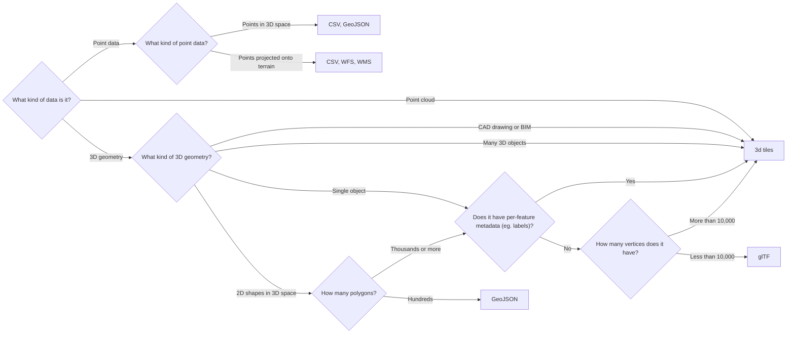

[![link to mermaid diagram](https://mermaid.ink/img/eyJjb2RlIjoiZ3JhcGggTFJcbiAgQXtXaGF0IGtpbmQgb2YgZGF0YSBpcyBpdD99IC0tPnxQb2ludCBkYXRhfCBCe1doYXQga2luZCBvZiBwb2ludCBkYXRhP31cbiAgQSAtLT4gfFBvaW50IGNsb3VkfCBJXG4gIEIgLS0-IHxQb2ludHMgaW4gM0Qgc3BhY2V8IENbQ1NWLCBHZW9KU09OXVxuICBCIC0tPiB8UG9pbnRzIHByb2plY3RlZCBvbnRvIHRlcnJhaW58IERbQ1NWLCBXRlMsIFdNU11cbiAgQSAtLT4gfDNEIGdlb21ldHJ5fCBFe1doYXQga2luZCBvZiAzRCBnZW9tZXRyeT99XG4gIEUgLS0-IHxDQUQgZHJhd2luZyBvciBCSU18IElbM2QgdGlsZXNdXG4gIEUgLS0-IHxNYW55IDNEIG9iamVjdHN8IElcbiAgRSAtLT4gfFNpbmdsZSBvYmplY3R8IEp7XCJEb2VzIGl0IGhhdmUgcGVyLWZlYXR1cmUgbWV0YWRhdGEgKGVnLiBsYWJlbHMpP1wifVxuICBKIC0tPiB8WWVzfCBJXG4gIEogLS0-IHxOb3wgR3tIb3cgbWFueSB2ZXJ0aWNlcyBkb2VzIGl0IGhhdmU_fVxuICBHIC0tPiB8TW9yZSB0aGFuIDEwLDAwMHwgSVxuICBHIC0tPiB8TGVzcyB0aGFuIDEwLDAwMHwgSFtnbFRGXVxuICBFIC0tPiB8MkQgc2hhcGVzIGluIDNEIHNwYWNlfCBLe0hvdyBtYW55IHBvbHlnb25zP31cbiAgSyAtLT4gfFRob3VzYW5kcyBvciBtb3JlfCBKXG4gIEsgLS0-IHxIdW5kcmVkc3wgRltHZW9KU09OXVxuXHRcdCIsIm1lcm1haWQiOnsidGhlbWUiOiJiYXNlIiwidGhlbWVWYXJpYWJsZXMiOnsiYmFja2dyb3VuZCI6IiNmNGY0ZjQiLCJkYXJrTW9kZSI6ZmFsc2UsInByaW1hcnlDb2xvciI6IiMwMGJjZTYiLCJub3RlQmtnQ29sb3IiOiIjZmZmNWFkIiwibm90ZVRleHRDb2xvciI6IiMzMzMiLCJmb250RmFtaWx5IjoiXCJ0cmVidWNoZXQgbXNcIiwgdmVyZGFuYSwgYXJpYWwiLCJmb250U2l6ZSI6IjE2cHgiLCJzZWNvbmRhcnlDb2xvciI6IiNkYWRiZGMiLCJsaW5lQ29sb3IiOiIjMDAxZDM0IiwicHJpbWFyeVRleHRDb2xvciI6IiMzMzMiLCJ0ZXJ0aWFyeUNvbG9yIjoiaHNsKDEwLjk1NjUyMTczOTEsIDEwMCUsIDUwLjA5ODAzOTIxNTclKSIsInByaW1hcnlCb3JkZXJDb2xvciI6ImhzbCgxOTAuOTU2NTIxNzM5MSwgNjAlLCAzNS4wOTgwMzkyMTU3JSkiLCJzZWNvbmRhcnlCb3JkZXJDb2xvciI6ImhzbCgyMTAsIDAlLCA3NS44ODIzNTI5NDEyJSkiLCJ0ZXJ0aWFyeUJvcmRlckNvbG9yIjoiaHNsKDEwLjk1NjUyMTczOTEsIDYwJSwgNDAuMDk4MDM5MjE1NyUpIiwibm90ZUJvcmRlckNvbG9yIjoiaHNsKDUyLjY4MjkyNjgyOTMsIDYwJSwgNzMuOTIxNTY4NjI3NSUpIiwic2Vjb25kYXJ5VGV4dENvbG9yIjoiIzI1MjQyMyIsInRlcnRpYXJ5VGV4dENvbG9yIjoicmdiKDEyNy4yNSwgMTI3LjI1LCAxMjcuMjUpIiwidGV4dENvbG9yIjoiIzMzMyIsIm5vZGVCa2ciOiIjMDBiY2U2IiwibWFpbkJrZyI6IiMwMGJjZTYiLCJub2RlQm9yZGVyIjoiaHNsKDE5MC45NTY1MjE3MzkxLCA2MCUsIDM1LjA5ODAzOTIxNTclKSIsImNsdXN0ZXJCa2ciOiJoc2woMTAuOTU2NTIxNzM5MSwgMTAwJSwgNTAuMDk4MDM5MjE1NyUpIiwiY2x1c3RlckJvcmRlciI6ImhzbCgxMC45NTY1MjE3MzkxLCA2MCUsIDQwLjA5ODAzOTIxNTclKSIsImRlZmF1bHRMaW5rQ29sb3IiOiIjMDAxZDM0IiwidGl0bGVDb2xvciI6InJnYigxMjcuMjUsIDEyNy4yNSwgMTI3LjI1KSIsImVkZ2VMYWJlbEJhY2tncm91bmQiOiIjZGFkYmRjIiwibm9kZVRleHRDb2xvciI6IiMzMzMiLCJhY3RvckJvcmRlciI6ImhzbCgxOTAuOTU2NTIxNzM5MSwgNjAlLCAzNS4wOTgwMzkyMTU3JSkiLCJhY3RvckJrZyI6IiMwMGJjZTYiLCJhY3RvclRleHRDb2xvciI6IiMzMzMiLCJhY3RvckxpbmVDb2xvciI6ImdyZXkiLCJsYWJlbEJveEJrZ0NvbG9yIjoiIzAwYmNlNiIsInNpZ25hbENvbG9yIjoiIzMzMyIsInNpZ25hbFRleHRDb2xvciI6IiMzMzMiLCJsYWJlbEJveEJvcmRlckNvbG9yIjoiaHNsKDE5MC45NTY1MjE3MzkxLCA2MCUsIDM1LjA5ODAzOTIxNTclKSIsImxhYmVsVGV4dENvbG9yIjoiIzMzMyIsImxvb3BUZXh0Q29sb3IiOiIjMzMzIiwiYWN0aXZhdGlvbkJvcmRlckNvbG9yIjoiaHNsKDIxMCwgMi43Nzc3Nzc3Nzc4JSwgNzUuODgyMzUyOTQxMiUpIiwiYWN0aXZhdGlvbkJrZ0NvbG9yIjoiI2RhZGJkYyIsInNlcXVlbmNlTnVtYmVyQ29sb3IiOiIjZmZlMmNiIiwic2VjdGlvbkJrZ0NvbG9yIjoiaHNsKDEwLjk1NjUyMTczOTEsIDEwMCUsIDUwLjA5ODAzOTIxNTclKSIsImFsdFNlY3Rpb25Ca2dDb2xvciI6IndoaXRlIiwic2VjdGlvbkJrZ0NvbG9yMiI6IiMwMGJjZTYiLCJ0YXNrQm9yZGVyQ29sb3IiOiJoc2woMTkwLjk1NjUyMTczOTEsIDYwJSwgMzUuMDk4MDM5MjE1NyUpIiwidGFza0JrZ0NvbG9yIjoiIzAwYmNlNiIsImFjdGl2ZVRhc2tCb3JkZXJDb2xvciI6IiMwMGJjZTYiLCJhY3RpdmVUYXNrQmtnQ29sb3IiOiJoc2woMTkwLjk1NjUyMTczOTEsIDEwMCUsIDY4LjA5ODAzOTIxNTclKSIsImdyaWRDb2xvciI6ImxpZ2h0Z3JleSIsImRvbmVUYXNrQmtnQ29sb3IiOiJsaWdodGdyZXkiLCJkb25lVGFza0JvcmRlckNvbG9yIjoiZ3JleSIsImNyaXRCb3JkZXJDb2xvciI6IiNmZjg4ODgiLCJjcml0QmtnQ29sb3IiOiJyZWQiLCJ0b2RheUxpbmVDb2xvciI6InJlZCIsInRhc2tUZXh0Q29sb3IiOiIjMzMzIiwidGFza1RleHRPdXRzaWRlQ29sb3IiOiIjMzMzIiwidGFza1RleHRMaWdodENvbG9yIjoiIzMzMyIsInRhc2tUZXh0RGFya0NvbG9yIjoiIzMzMyIsInRhc2tUZXh0Q2xpY2thYmxlQ29sb3IiOiIjMDAzMTYzIiwibGFiZWxDb2xvciI6IiMzMzMiLCJhbHRCYWNrZ3JvdW5kIjoiaHNsKDEwLjk1NjUyMTczOTEsIDEwMCUsIDUwLjA5ODAzOTIxNTclKSIsImVycm9yQmtnQ29sb3IiOiJoc2woMTAuOTU2NTIxNzM5MSwgMTAwJSwgNTAuMDk4MDM5MjE1NyUpIiwiZXJyb3JUZXh0Q29sb3IiOiJyZ2IoMTI3LjI1LCAxMjcuMjUsIDEyNy4yNSkiLCJjbGFzc1RleHQiOiIjMzMzIiwiZmlsbFR5cGUwIjoiIzAwYmNlNiIsImZpbGxUeXBlMSI6IiNkYWRiZGMiLCJmaWxsVHlwZTIiOiJoc2woMjU0Ljk1NjUyMTczOTEsIDEwMCUsIDQ1LjA5ODAzOTIxNTclKSIsImZpbGxUeXBlMyI6ImhzbCgyNzQsIDIuNzc3Nzc3Nzc3OCUsIDg1Ljg4MjM1Mjk0MTIlKSIsImZpbGxUeXBlNCI6ImhzbCgxMjYuOTU2NTIxNzM5MSwgMTAwJSwgNDUuMDk4MDM5MjE1NyUpIiwiZmlsbFR5cGU1IjoiaHNsKDE0NiwgMi43Nzc3Nzc3Nzc4JSwgODUuODgyMzUyOTQxMiUpIiwiZmlsbFR5cGU2IjoiaHNsKDMxOC45NTY1MjE3MzkxLCAxMDAlLCA0NS4wOTgwMzkyMTU3JSkiLCJmaWxsVHlwZTciOiJoc2woMzM4LCAyLjc3Nzc3Nzc3NzglLCA4NS44ODIzNTI5NDEyJSkifX0sInVwZGF0ZUVkaXRvciI6ZmFsc2V9)](https://mermaid-js.github.io/mermaid-live-editor/#/edit/eyJjb2RlIjoiZ3JhcGggTFJcbiAgQXtXaGF0IGtpbmQgb2YgZGF0YSBpcyBpdD99IC0tPnxQb2ludCBkYXRhfCBCe1doYXQga2luZCBvZiBwb2ludCBkYXRhP31cbiAgQSAtLT4gfFBvaW50IGNsb3VkfCBJXG4gIEIgLS0-IHxQb2ludHMgaW4gM0Qgc3BhY2V8IENbQ1NWLCBHZW9KU09OXVxuICBCIC0tPiB8UG9pbnRzIHByb2plY3RlZCBvbnRvIHRlcnJhaW58IERbQ1NWLCBXRlMsIFdNU11cbiAgQSAtLT4gfDNEIGdlb21ldHJ5fCBFe1doYXQga2luZCBvZiAzRCBnZW9tZXRyeT99XG4gIEUgLS0-IHxDQUQgZHJhd2luZyBvciBCSU18IElbM2QgdGlsZXNdXG4gIEUgLS0-IHxNYW55IDNEIG9iamVjdHN8IElcbiAgRSAtLT4gfFNpbmdsZSBvYmplY3R8IEp7XCJEb2VzIGl0IGhhdmUgcGVyLWZlYXR1cmUgbWV0YWRhdGEgKGVnLiBsYWJlbHMpP1wifVxuICBKIC0tPiB8WWVzfCBJXG4gIEogLS0-IHxOb3wgR3tIb3cgbWFueSB2ZXJ0aWNlcyBkb2VzIGl0IGhhdmU_fVxuICBHIC0tPiB8TW9yZSB0aGFuIDEwLDAwMHwgSVxuICBHIC0tPiB8TGVzcyB0aGFuIDEwLDAwMHwgSFtnbFRGXVxuICBFIC0tPiB8MkQgc2hhcGVzIGluIDNEIHNwYWNlfCBLe0hvdyBtYW55IHBvbHlnb25zP31cbiAgSyAtLT4gfFRob3VzYW5kcyBvciBtb3JlfCBKXG4gIEsgLS0-IHxIdW5kcmVkc3wgRltHZW9KU09OXVxuXHRcdCIsIm1lcm1haWQiOnsidGhlbWUiOiJiYXNlIiwidGhlbWVWYXJpYWJsZXMiOnsiYmFja2dyb3VuZCI6IiNmNGY0ZjQiLCJkYXJrTW9kZSI6ZmFsc2UsInByaW1hcnlDb2xvciI6IiMwMGJjZTYiLCJub3RlQmtnQ29sb3IiOiIjZmZmNWFkIiwibm90ZVRleHRDb2xvciI6IiMzMzMiLCJmb250RmFtaWx5IjoiXCJ0cmVidWNoZXQgbXNcIiwgdmVyZGFuYSwgYXJpYWwiLCJmb250U2l6ZSI6IjE2cHgiLCJzZWNvbmRhcnlDb2xvciI6IiNkYWRiZGMiLCJsaW5lQ29sb3IiOiIjMDAxZDM0IiwicHJpbWFyeVRleHRDb2xvciI6IiMzMzMiLCJ0ZXJ0aWFyeUNvbG9yIjoiaHNsKDEwLjk1NjUyMTczOTEsIDEwMCUsIDUwLjA5ODAzOTIxNTclKSIsInByaW1hcnlCb3JkZXJDb2xvciI6ImhzbCgxOTAuOTU2NTIxNzM5MSwgNjAlLCAzNS4wOTgwMzkyMTU3JSkiLCJzZWNvbmRhcnlCb3JkZXJDb2xvciI6ImhzbCgyMTAsIDAlLCA3NS44ODIzNTI5NDEyJSkiLCJ0ZXJ0aWFyeUJvcmRlckNvbG9yIjoiaHNsKDEwLjk1NjUyMTczOTEsIDYwJSwgNDAuMDk4MDM5MjE1NyUpIiwibm90ZUJvcmRlckNvbG9yIjoiaHNsKDUyLjY4MjkyNjgyOTMsIDYwJSwgNzMuOTIxNTY4NjI3NSUpIiwic2Vjb25kYXJ5VGV4dENvbG9yIjoiIzI1MjQyMyIsInRlcnRpYXJ5VGV4dENvbG9yIjoicmdiKDEyNy4yNSwgMTI3LjI1LCAxMjcuMjUpIiwidGV4dENvbG9yIjoiIzMzMyIsIm5vZGVCa2ciOiIjMDBiY2U2IiwibWFpbkJrZyI6IiMwMGJjZTYiLCJub2RlQm9yZGVyIjoiaHNsKDE5MC45NTY1MjE3MzkxLCA2MCUsIDM1LjA5ODAzOTIxNTclKSIsImNsdXN0ZXJCa2ciOiJoc2woMTAuOTU2NTIxNzM5MSwgMTAwJSwgNTAuMDk4MDM5MjE1NyUpIiwiY2x1c3RlckJvcmRlciI6ImhzbCgxMC45NTY1MjE3MzkxLCA2MCUsIDQwLjA5ODAzOTIxNTclKSIsImRlZmF1bHRMaW5rQ29sb3IiOiIjMDAxZDM0IiwidGl0bGVDb2xvciI6InJnYigxMjcuMjUsIDEyNy4yNSwgMTI3LjI1KSIsImVkZ2VMYWJlbEJhY2tncm91bmQiOiIjZGFkYmRjIiwibm9kZVRleHRDb2xvciI6IiMzMzMiLCJhY3RvckJvcmRlciI6ImhzbCgxOTAuOTU2NTIxNzM5MSwgNjAlLCAzNS4wOTgwMzkyMTU3JSkiLCJhY3RvckJrZyI6IiMwMGJjZTYiLCJhY3RvclRleHRDb2xvciI6IiMzMzMiLCJhY3RvckxpbmVDb2xvciI6ImdyZXkiLCJsYWJlbEJveEJrZ0NvbG9yIjoiIzAwYmNlNiIsInNpZ25hbENvbG9yIjoiIzMzMyIsInNpZ25hbFRleHRDb2xvciI6IiMzMzMiLCJsYWJlbEJveEJvcmRlckNvbG9yIjoiaHNsKDE5MC45NTY1MjE3MzkxLCA2MCUsIDM1LjA5ODAzOTIxNTclKSIsImxhYmVsVGV4dENvbG9yIjoiIzMzMyIsImxvb3BUZXh0Q29sb3IiOiIjMzMzIiwiYWN0aXZhdGlvbkJvcmRlckNvbG9yIjoiaHNsKDIxMCwgMi43Nzc3Nzc3Nzc4JSwgNzUuODgyMzUyOTQxMiUpIiwiYWN0aXZhdGlvbkJrZ0NvbG9yIjoiI2RhZGJkYyIsInNlcXVlbmNlTnVtYmVyQ29sb3IiOiIjZmZlMmNiIiwic2VjdGlvbkJrZ0NvbG9yIjoiaHNsKDEwLjk1NjUyMTczOTEsIDEwMCUsIDUwLjA5ODAzOTIxNTclKSIsImFsdFNlY3Rpb25Ca2dDb2xvciI6IndoaXRlIiwic2VjdGlvbkJrZ0NvbG9yMiI6IiMwMGJjZTYiLCJ0YXNrQm9yZGVyQ29sb3IiOiJoc2woMTkwLjk1NjUyMTczOTEsIDYwJSwgMzUuMDk4MDM5MjE1NyUpIiwidGFza0JrZ0NvbG9yIjoiIzAwYmNlNiIsImFjdGl2ZVRhc2tCb3JkZXJDb2xvciI6IiMwMGJjZTYiLCJhY3RpdmVUYXNrQmtnQ29sb3IiOiJoc2woMTkwLjk1NjUyMTczOTEsIDEwMCUsIDY4LjA5ODAzOTIxNTclKSIsImdyaWRDb2xvciI6ImxpZ2h0Z3JleSIsImRvbmVUYXNrQmtnQ29sb3IiOiJsaWdodGdyZXkiLCJkb25lVGFza0JvcmRlckNvbG9yIjoiZ3JleSIsImNyaXRCb3JkZXJDb2xvciI6IiNmZjg4ODgiLCJjcml0QmtnQ29sb3IiOiJyZWQiLCJ0b2RheUxpbmVDb2xvciI6InJlZCIsInRhc2tUZXh0Q29sb3IiOiIjMzMzIiwidGFza1RleHRPdXRzaWRlQ29sb3IiOiIjMzMzIiwidGFza1RleHRMaWdodENvbG9yIjoiIzMzMyIsInRhc2tUZXh0RGFya0NvbG9yIjoiIzMzMyIsInRhc2tUZXh0Q2xpY2thYmxlQ29sb3IiOiIjMDAzMTYzIiwibGFiZWxDb2xvciI6IiMzMzMiLCJhbHRCYWNrZ3JvdW5kIjoiaHNsKDEwLjk1NjUyMTczOTEsIDEwMCUsIDUwLjA5ODAzOTIxNTclKSIsImVycm9yQmtnQ29sb3IiOiJoc2woMTAuOTU2NTIxNzM5MSwgMTAwJSwgNTAuMDk4MDM5MjE1NyUpIiwiZXJyb3JUZXh0Q29sb3IiOiJyZ2IoMTI3LjI1LCAxMjcuMjUsIDEyNy4yNSkiLCJjbGFzc1RleHQiOiIjMzMzIiwiZmlsbFR5cGUwIjoiIzAwYmNlNiIsImZpbGxUeXBlMSI6IiNkYWRiZGMiLCJmaWxsVHlwZTIiOiJoc2woMjU0Ljk1NjUyMTczOTEsIDEwMCUsIDQ1LjA5ODAzOTIxNTclKSIsImZpbGxUeXBlMyI6ImhzbCgyNzQsIDIuNzc3Nzc3Nzc3OCUsIDg1Ljg4MjM1Mjk0MTIlKSIsImZpbGxUeXBlNCI6ImhzbCgxMjYuOTU2NTIxNzM5MSwgMTAwJSwgNDUuMDk4MDM5MjE1NyUpIiwiZmlsbFR5cGU1IjoiaHNsKDE0NiwgMi43Nzc3Nzc3Nzc4JSwgODUuODgyMzUyOTQxMiUpIiwiZmlsbFR5cGU2IjoiaHNsKDMxOC45NTY1MjE3MzkxLCAxMDAlLCA0NS4wOTgwMzkyMTU3JSkiLCJmaWxsVHlwZTciOiJoc2woMzM4LCAyLjc3Nzc3Nzc3NzglLCA4NS44ODIzNTI5NDEyJSkifX0sInVwZGF0ZUVkaXRvciI6ZmFsc2V9)

# Mermaid diagram source

# Mermaid config
```json
{
  "theme": "base",
  "themeVariables": {
    "primaryColor": "#00bce6",
    "secondaryColor": "#dadbdc",
    "lineColor": "#001d34"
  }
}
```